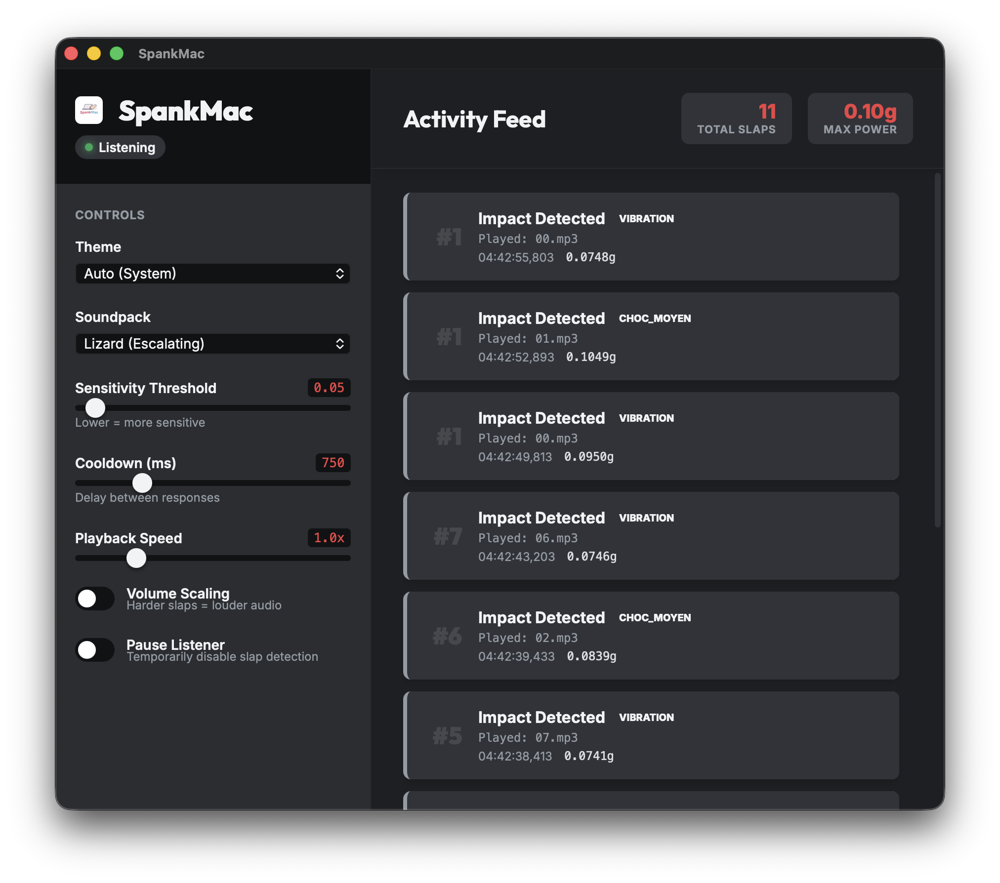

# SpankMac



For Apple Silicon MacBooks. Detect physical hits using the internal accelerometer and play audio. [Based on taigrr/spank](https://github.com/taigrr/spank), added custom features, including a custom-made GUI.

## Prerequisites

- macOS on Apple Silicon (M-series)
- `sudo` access

## Quick Start

```bash
Download & unzip latest release.  
Drag into Applications folder.  
Run the Application and HF.  
```

## Modes

- **Default**: Random pain sounds.
- **Sexy**: Escalating intensity based on slap frequency.
- **Halo**: Halo sound effects.
- **Lizard**: Lizard.
- **Half-Life 2**: Sounds from Half-Life 2.

## Credits
Sensor reading and vibration detection ported from olvvier/apple-silicon-accelerometer.
Spank by [taigrr/spank](https://github.com/taigrr/spank)

## License

MIT
